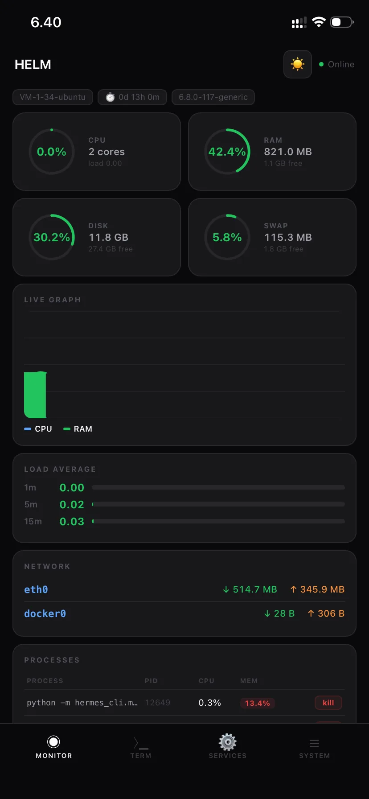
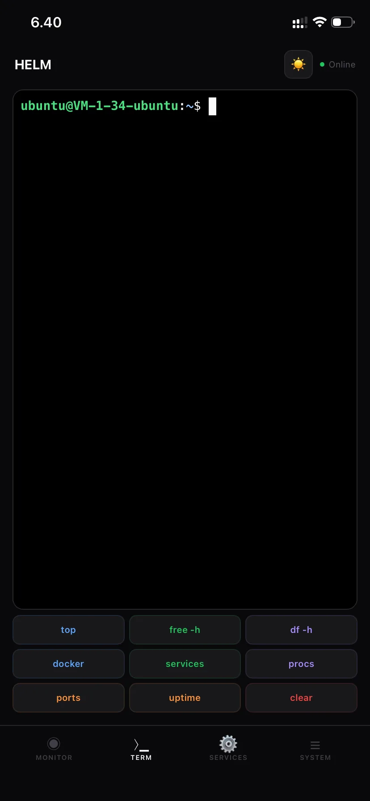
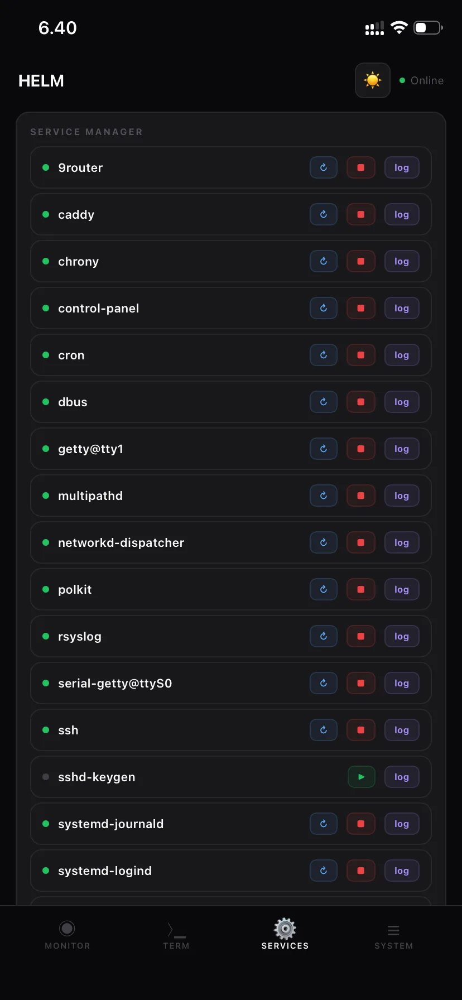
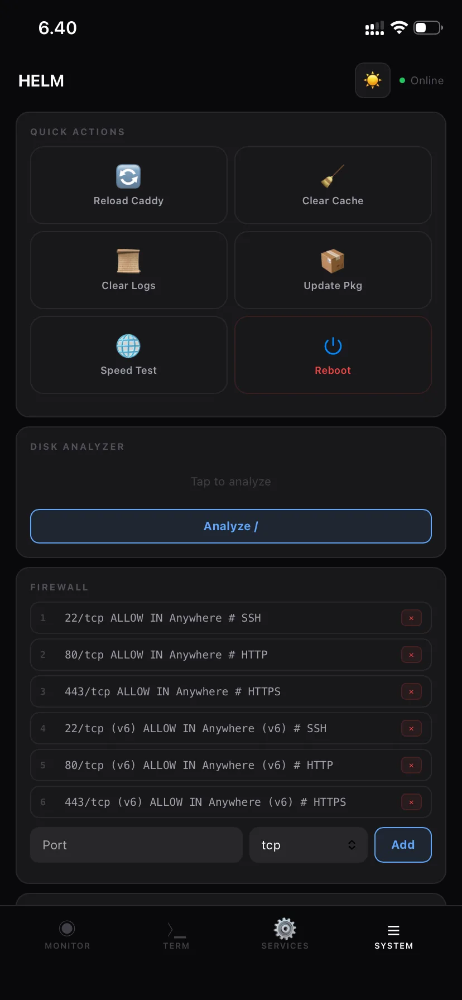

# HELM 🚢
**The Minimalist, Mobile-First Server Command Center.**

HELM is a lightweight, high-performance web dashboard designed for developers who need to manage their infrastructure on the go. No bloat, no complex configurations—just pure control.

[](https://opensource.org/licenses/MIT)
[](https://nodejs.org/)

## ⚡ Why HELM?
Most server panels are too heavy or not designed for mobile. HELM is different. It's a Progressive Web App (PWA) that feels like a native app on your iPhone or Android, giving you a full-blown terminal and system controls right in your pocket.

## ✨ Features
- 📊 **Zero-Latency Monitoring**: Real-time CPU, RAM, Disk, and Load Average metrics.
- 📈 **Live Analytics**: Beautiful, dark-themed charts for resource tracking.
- ⚙️ **Service Orchestration**: Start, stop, and restart systemd services with a single tap.
- ⟩_ **Full Web Terminal**: High-performance xterm.js terminal with full keyboard support.
- 📜 **Live Journal**: Stream system logs directly to your device via WebSockets.
- ☰ **Quick Actions**: One-tap server reboots, cache clearing, and package updates.
- 🛡️ **Built-in Security**: Firewall (UFW) management and native authentication UI.
- 📱 **PWA Perfection**: Add to Home Screen for a fullscreen, standalone experience.

## 📸 Screenshots

| Monitor | Terminal |
|:---:|:---:|
|  |  |
| **Real-time metrics, live graph & per-process control.** | **Full web terminal with one-tap shortcuts.** |

| Services | System |
|:---:|:---:|
|  |  |
| **systemd manager: restart, stop & tail logs per service.** | **Quick actions, disk analyzer & UFW firewall.** |

## 🛠 Tech Stack
- **Backend**: Node.js core `http` module (no web framework — zero overhead)
- **Communication**: WebSockets (`ws`) for real-time duplex streaming
- **Terminal**: `node-pty` (server-side PTY) + xterm.js (browser)
- **Frontend**: Pure Vanilla JS & CSS Variables (Zero dependencies, ultra-fast)
- **Config**: `dotenv`

## 🚀 Quick Start
1. **Clone & Install**
   ```bash
   git clone https://github.com/yourusername/helm.git
   cd helm
   npm install
   ```
2. **Configure** (optional — sensible defaults are baked in)
   Create a `.env` file in the project root:
   ```bash
   HELM_PORT=20131
   HELM_USER=admin
   HELM_PASS=change-me
   ```
3. **Launch**
   ```bash
   npm start      # production
   npm run dev    # auto-reload via nodemon
   ```
   HELM listens on `http://0.0.0.0:20131` by default.

4. **Secure with Caddy (Recommended)**
   Add this to your `Caddyfile`:
   ```caddy
   control.yourdomain.com {
       reverse_proxy localhost:20131
   }
   ```

## ⚙️ Configuration
| Variable    | Default      | Description                                  |
|-------------|--------------|----------------------------------------------|
| `HELM_PORT` | `20131`      | HTTP/WebSocket listen port                   |
| `HELM_USER` | `admin`      | Basic-auth username                          |
| `HELM_PASS` | `password`   | Basic-auth password — **change in production** |

## 📁 Project Structure
```
helm/
├── src/
│   ├── app.js              # HTTP + WebSocket bootstrap
│   ├── api/
│   │   └── router.js       # Static file serving + all /api/* routes
│   ├── ws/
│   │   └── handler.js      # /ws/terminal and /ws/logs/* streams
│   ├── middleware/
│   │   ├── auth.js         # Basic-auth (header + WS query param)
│   │   └── logger.js       # Request logging
│   └── utils/
│       └── metrics.js      # System metrics collection
├── public/                 # PWA frontend (index.html, manifest, sw, icon)
└── docs/                   # Documentation & screenshots
```

## 📚 Documentation
- [Architecture](docs/ARCHITECTURE.md) — how the pieces fit together
- [Configuration](docs/CONFIGURATION.md) — environment variables & deployment
- [API Reference](docs/API.md) — REST endpoints & WebSocket protocol

## 🔒 Security Note
HELM executes privileged system commands (`systemctl`, `ufw`, `kill`, `reboot`) and exposes a full shell over WebSocket. **Never expose it to the public internet without TLS and authentication.** Always run it behind a reverse proxy (Caddy/Nginx) with HTTPS. Authentication is enforced via HTTP Basic Auth on every `/api/*` route and via an `auth` query parameter on WebSocket connections — see [docs/CONFIGURATION.md](docs/CONFIGURATION.md#security).

---
*Take the helm of your infrastructure. Sikat! 🚀*
